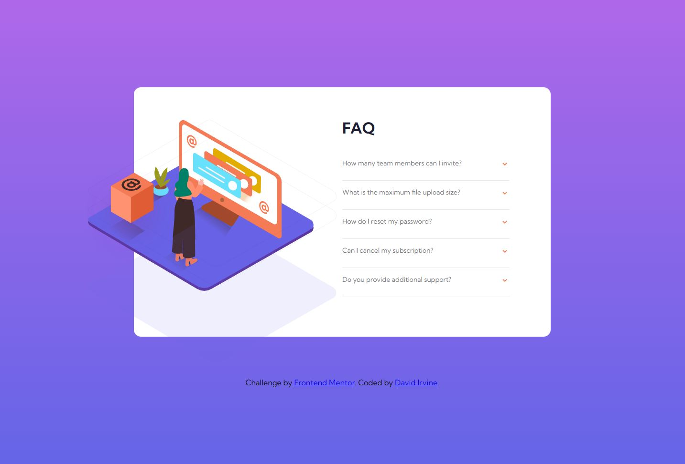

# Frontend Mentor - FAQ accordion card solution

This is a solution to the [FAQ accordion card challenge on Frontend Mentor](https://www.frontendmentor.io/challenges/faq-accordion-card-XlyjD0Oam). Frontend Mentor challenges help you improve your coding skills by building realistic projects. 

### Screenshot

### Links

- Solution URL: [solution URL ](https://github.com/DavidIrvine-TW/frontend-Mentor-accordian-card-solution)
- Live Site URL: [live site](https://davidirvine-tw.github.io/frontend-Mentor-accordian-card-solution/)

## My process

### Built with

- Semantic HTML5 markup
- CSS custom properties
- Flexbox
- CSS Grid
- Mobile-first workflow

## Author

- Website - [@david irvine](https://github.com/DavidIrvine-TW)
- Frontend Mentor - [@david irvine](https://www.frontendmentor.io/profile/DavidIrvine-TW)

